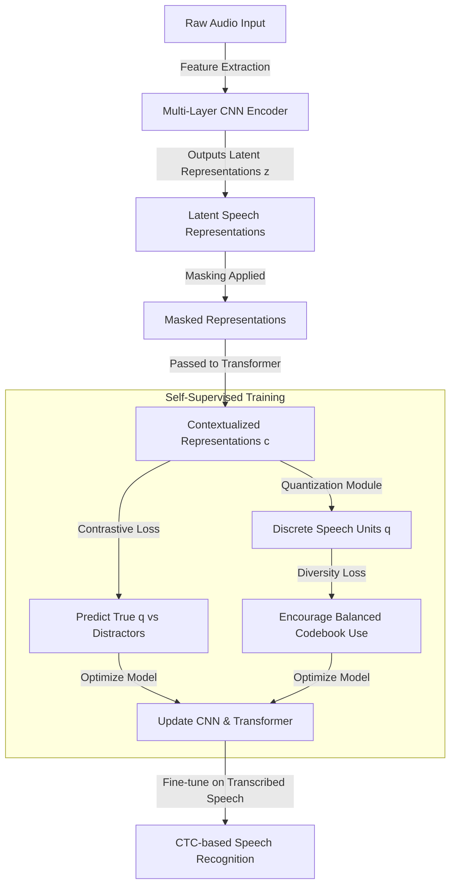
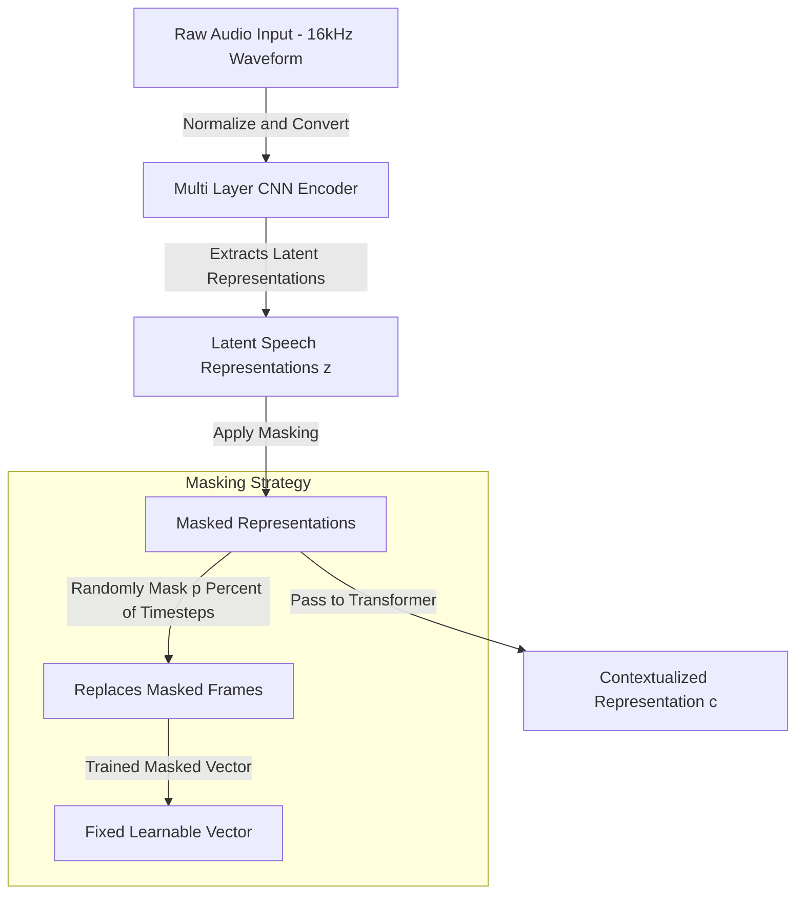
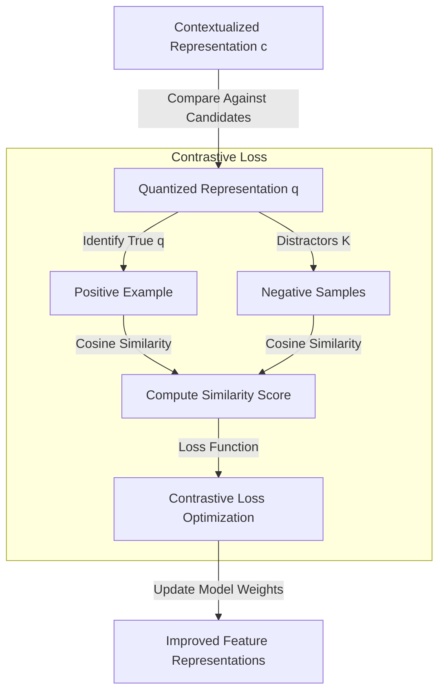
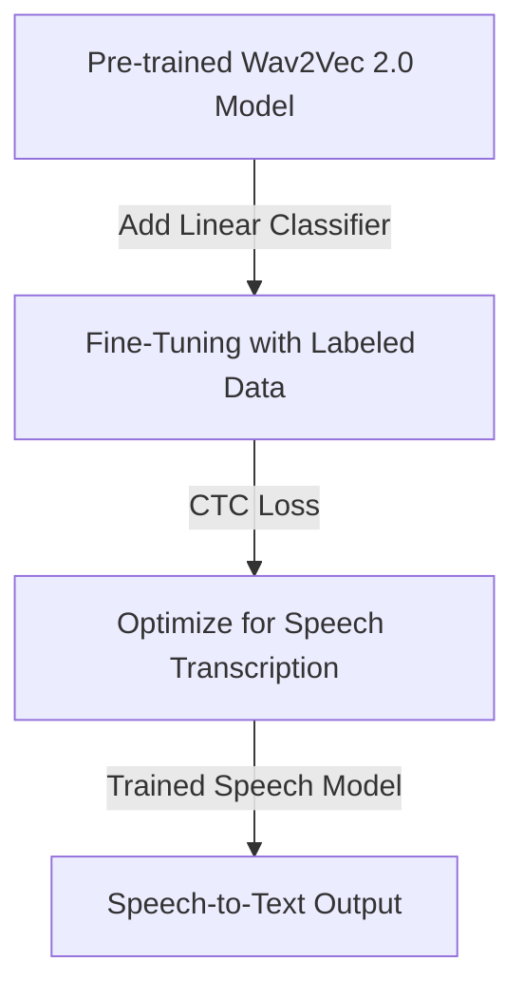

# wav2vec 2.0: A Framework for Self-Supervised Learning of Speech Representations
[Paper](https://arxiv.org/pdf/2006.11477) |
[GitHub](https://github.com/facebookresearch/fairseq)
## ✨ 1. Overall Flow of Wav2Vec 2.0 ✨

## ✨ 2. Feature Extraction & Masking Process ✨

## ✨ 3. Contrastive Training with Quantization ✨

## ✨ 4. Fine-Tuning for Downstream Tasks ✨

---
