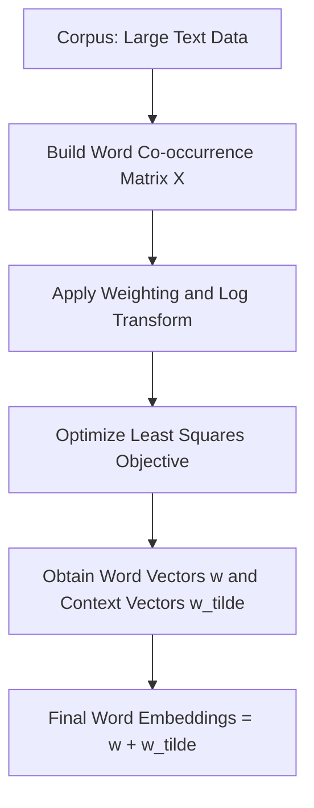
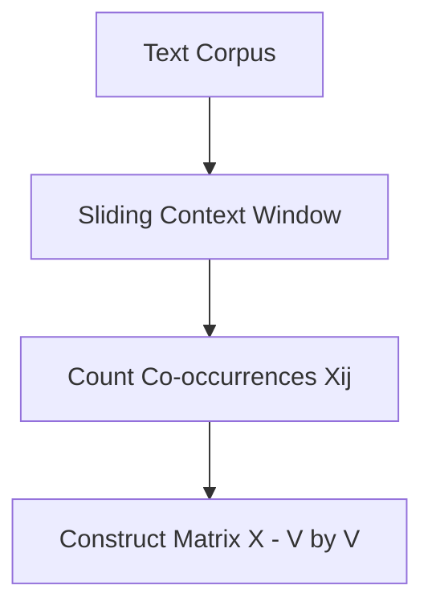
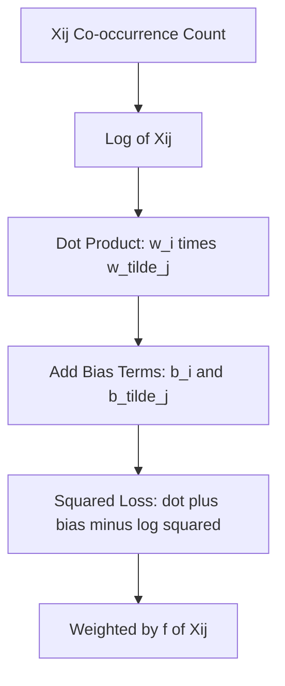
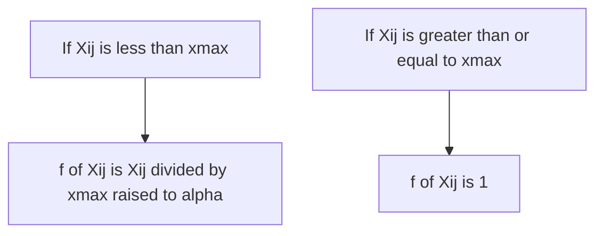
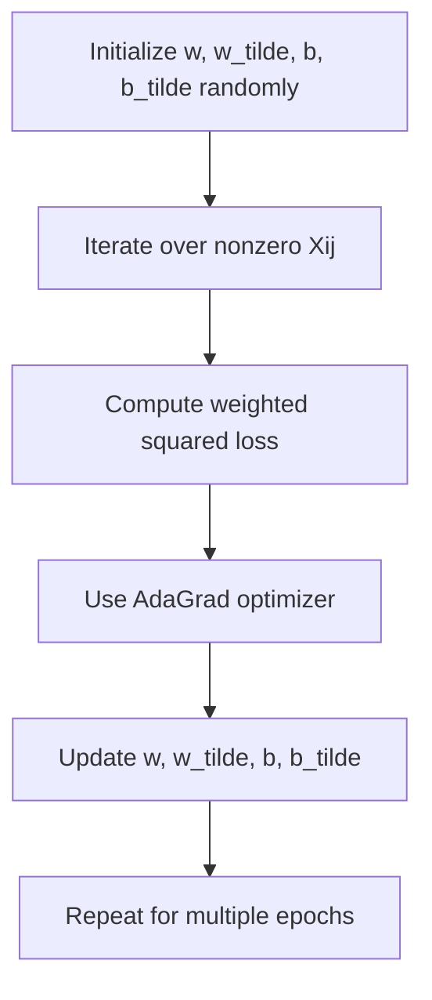
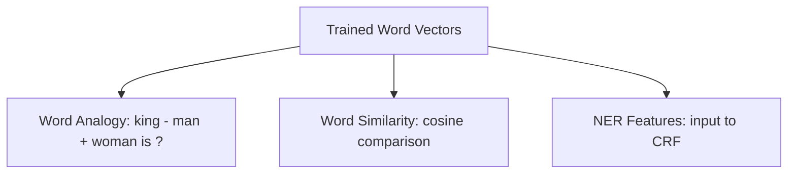

# GloVe: Global Vectors for Word Representation

This document explains the key steps in the GloVe paper using multiple **Mermaid diagrams** with example dimensions for clarity.

---

## 1. Overview of GloVe Architecture

GloVe builds on **global co-occurrence statistics** of word pairs and directly **factorizes a log-transformed co-occurrence matrix**.

---

## 2. Co-occurrence Matrix Construction

**Example**: For a vocabulary of size `V = 100,000`, the resulting co-occurrence matrix `X` would be `100,000 × 100,000` but sparse.

---

## 3. Core GloVe Objective Function

$$
J = \sum_{i,j} f(X_{ij}) \cdot (w_i^\top \tilde{w}_j + b_i + \tilde{b}_j - \log(X_{ij}))^2
$$

---

## 4. Weighting Function f(Xij)

**Default Parameters**:
- `xmax = 100`
- `α = 3/4`

---

## 5. Training Process

---

## 6. Evaluation Workflow

GloVe vectors are tested on:
- **Word analogy tasks**
- **Semantic similarity**
- **Named Entity Recognition** (NER)

---

## ✅ Summary of Benefits
- Combines **count-based** and **predictive** models.
- Learns **linear substructures** in word space.
- Efficient: only uses **nonzero co-occurrence values**.
- Strong performance on various **NLP tasks**.

---

Generated using Mermaid for clarity and educational purposes.

