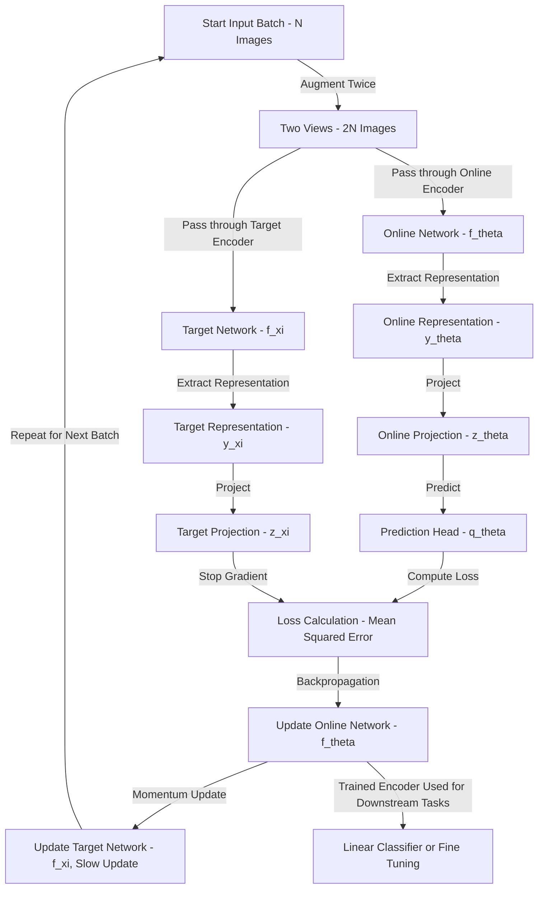
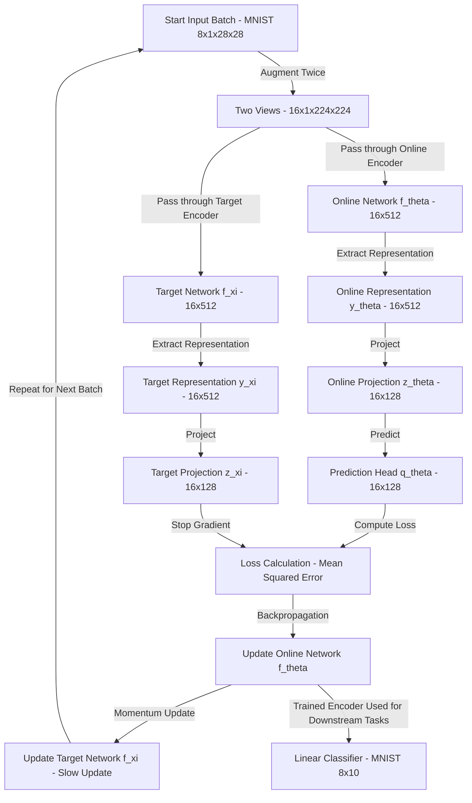

# Bootstrap Your Own Latent A New Approach to Self-Supervised Learning
[Paper](https://arxiv.org/pdf/2006.07733) |
[GitHub](https://github.com/google-deepmind/deepmind-research/tree/master/byol)

## Flow of the main method

 
 
 
 
 

# Flow with example shapes and batchsize of 8

