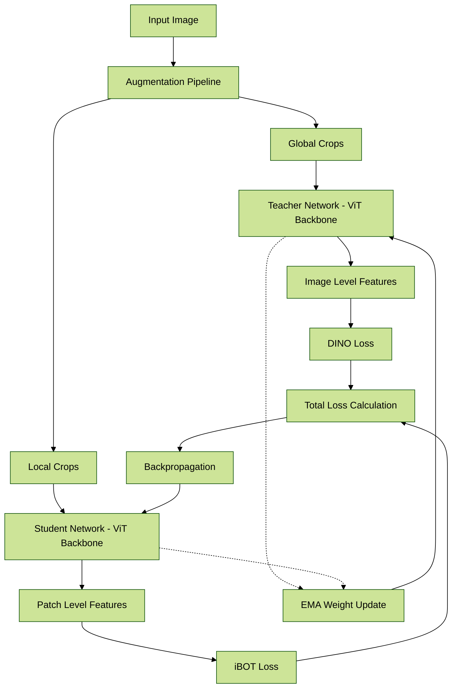
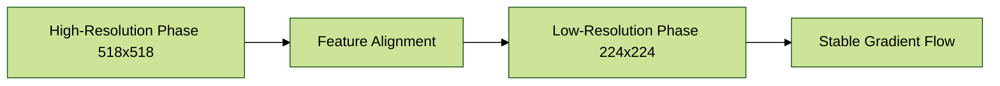
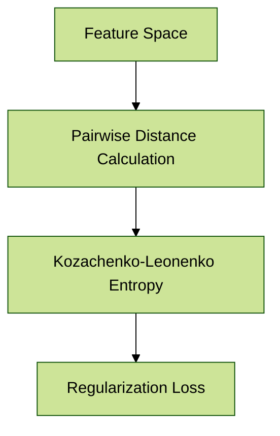
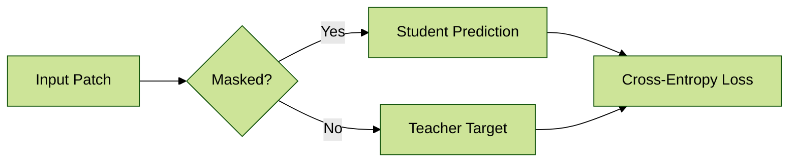
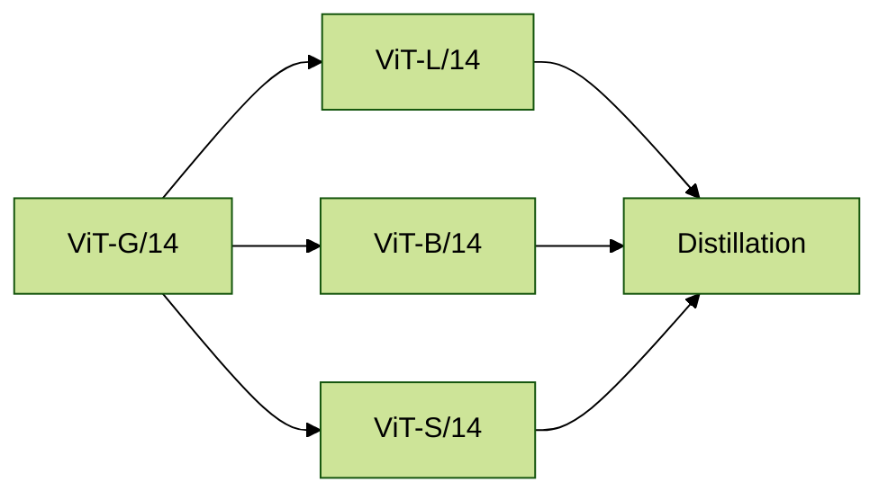
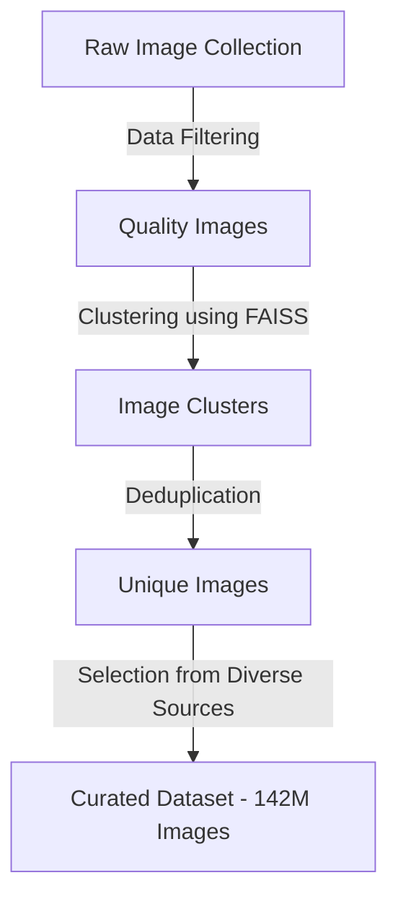
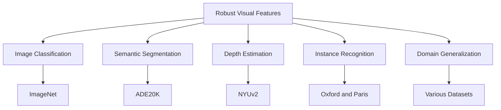

# DINOv2: Learning Robust Visual Features without Supervision
[Paper](https://arxiv.org/abs/2304.07193) | [GitHub](https://github.com/facebookresearch/dinov2)

## With Perplexity Deep search

1.	Augmentation Pipeline: Generates multiple views including:

	•	2 global crops (224x224 pixels)

	•	5 local crops (96x96 pixels)
2. Teacher Network: Processes only global crops using:

	•	Vision Transformer (ViT) backbone

	•	Exponential Moving Average (EMA) weights

	•	Centered features without gradient updates

3. Student Network: Processes all crops with:

	•	Identical ViT architecture

	•	Active gradient updates

	•	Combined DINO/iBOT objectives



### Multi-Resolution Training

### KoLeo Regularization


### Masked Image Modeling



### Performance Characteristics


### Benchmark Results

```mermaid
%%{init: {'theme': 'forest'}}%%
flowchart TD
    A[ImageNet-1k] --> B[90.1% Linear Probe]
    C[NYUv2 Depth] --> D[δ1=0.923]
    E[ADE20K Segmentation] --> F[48.6 mIoU]
    G[Image Retrieval] --> H[Recall@1=85.3%]
```

## With ChatGPT 4o

### Overall Architecture of DINOv2

```mermaid
graph TD;
    A[Curated Image Dataset - 142M Images] -->|Input| B[Data Augmentation]
    B --> C[Vision Transformer - ViT Backbone]
    C --> D[Self-Supervised Training with DINO and iBOT Losses]
    D --> E[Robust Visual Features]
    E --> F[Evaluation on Multiple Benchmarks]
````
### Self-Supervised Training Process

```mermaid
graph TD;
    A[Input Image] -->|Augmentation| B[Global and Local Views]
    B --> C[Student Network - ViT Backbone]
    B --> D[Teacher Network - EMA of Student]
    C -->|Output| E[Student Features]
    D -->|Output| F[Teacher Features]
    E --> G[Compute DINO Loss]
    F --> G
    G --> H[Backpropagation to Student Network]
    D --> I[EMA Update of Teacher Network]
```

### Data Curation Pipeline


### Evaluation Benchmarks
